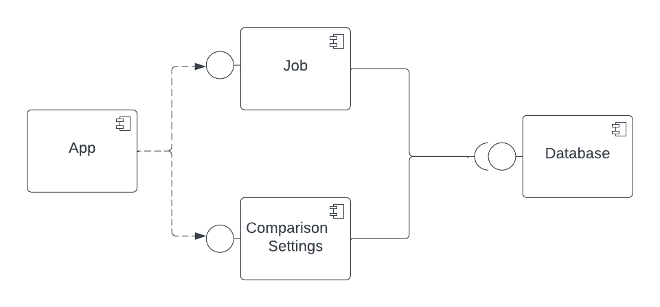
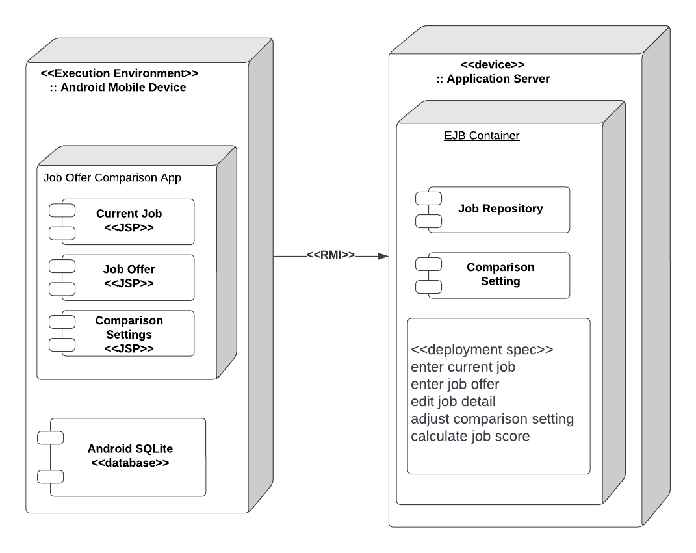
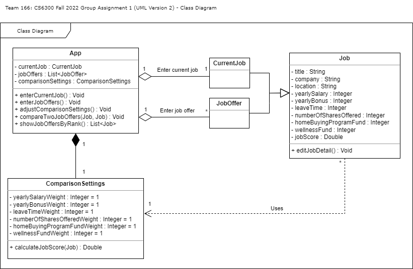
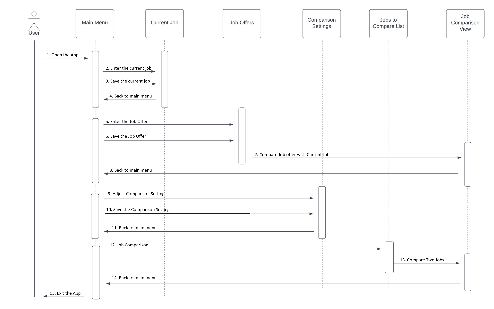
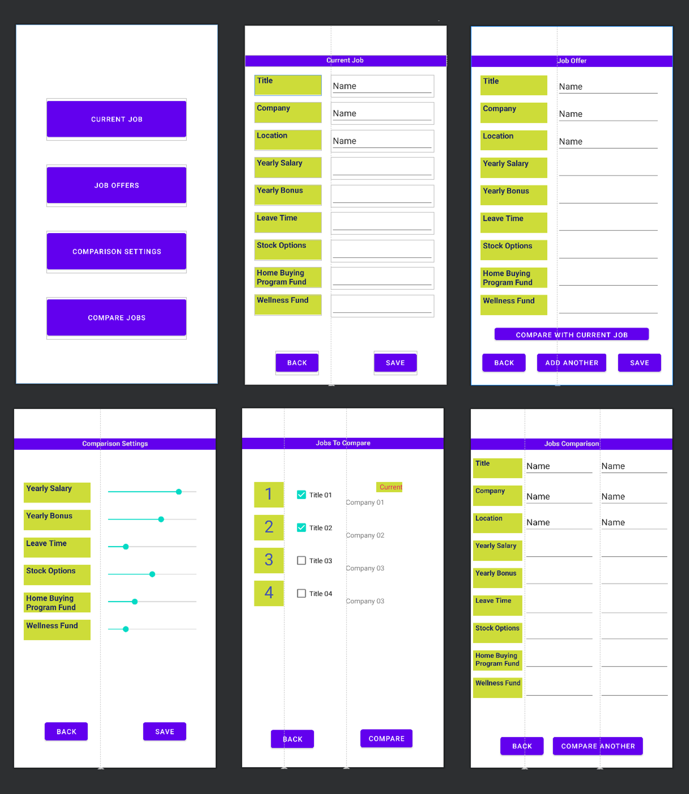

# Design Document

**Author**: Team 166

## 1 Design Considerations

### 1.1 Assumptions

Here's the assumptions of the app: 

* The app is designed to be used on the Android Platform running the minimum SDK of API 30: Android 11.0 (R) or above.
* The app assumes there is a single system running the app (no communication or syncing between devices is necessary).
* The app assumes all the field values are required for all the functions, such as adding jobs, comparing jobs, etc.
* The app assumes the language to be English.
* The app requires selecting at least two job offers or one job offer with current job filled to provide comparison.
* The app can only compare exactly two jobs, no more than two jobs can be compared at a time.
* The app assumes the user has only one current job.
* The app assumes the job detail attributes are final and no more other attributes can be added on top of it.
* The app assumes the formula to calculate job score to be as the following: w1\*AYS + w2\*AYB + (w3\*LT \* w1\*AYS / 260) + (w4\*CSO/2) + w5\*HBP + w6\*WF.
* The app assumes the highest job score to be the highest rank and so on.
* The app is intended to be used on an android Phone with touch screen enabled.
* The app can be used locally without connecting to the Internet.

### 1.2 Constraints

Here's the constraints that might impact on the design of the system:

* Time given to design and develop the app might not be enough. 
* Certain skill-sets, such as Android programming, database design, etc. are required to develop the app.
* Remote collaboration and communication might be challenging, especially when team members are from different timezones.
* Change of requirements from the client, such as:  
	* Support multiple user accounts with login/logout functionality
	* Sync data online and allow sharing data across different devices 
	* Additional feature requests such as comparing more than two jobs, adding more job details, etc. 

### 1.3 System Environment

The hardware and software that the system must operate in and interact with must be an Android-based phone with the minimum SDK of API 30: Android 11.0 (R) or above. The software that is used for developing the app is Android Studio with Java 11.

## 2 Architectural Design

### 2.1 Component Diagram

There are 4 components: App, Job, Comparison Settings, and Database. App communicates with Job and Comparison Settings when the user interacts with the app. The job and comparison settings will then communicate with the database when there is a need to save or retrieve records.  

### 2.2 Deployment Diagram

The app can be installed on an Android phone via apk. All the data will be stored locally inside a SQLite database within the app. If required (will not do), the app can communicate with remote application server to upload and retrieve data. 

## 3 Low-Level Design

### 3.1 Class Diagram

The UML class diagram is the same as the one from deliverable 1. There are no updates or changes to the class diagram as of now.  

### 3.2 Other Diagrams

We include a sequence diagram to describe some dynamic aspects of the app. The sequence diagram above is pretty self-explanatory.

## 4 User Interface Design

Lastly, we include a graphical design mockups to show how the app will look like when running inside an Android phone. Our app does not intend for all sorts of screen size, hence it might look weird or out of order if your Android phone screen size is not the industry standard one. 