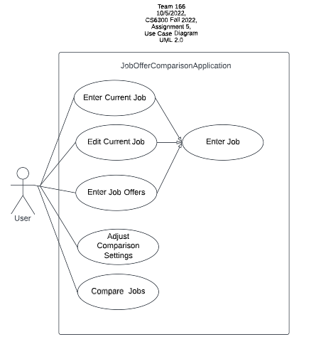

# Use Case Model

**Author**: Team 166

## 1 Use Case Diagram

## 2 Use Case Descriptions

* Use Case 1: Enter Job

	* Requirements: Allows the user to save the information of a job, either current job or a job offer
	* Pre-conditions: N/A
	* Post-conditions: The Job details will be stored in a Job Object saved in the App
	* Scenarios:
		* Normal:
			* The user will press the "Current Job" or "Job Offers" button in the main menu.
			* The system will present all of the attributes of a job including Title, Company, Location, Yearly Salary, Yearly Bonus, Leave Time, Stock Options, Home Buying Program Fund and Wellness Fund in editable textboxes, either left blank or filled with saved information, depending on the function selected. 
			* The user will enter or edit the above information.
			* If the user presses the Save button, the job details will be saved in the system and the system will throw a message indicating the operation has been conducted successfully.
			* If the user presses the Back button, the job details will not be saved.
			* The user will be directed to either main menu or stay in the same page depending on the function.
		* Exception:
			* If the user does not enter all the required information, the system will show an error message on the screen.

* Use Case 2: Enter Current Job (inherits Enter Job)
	* Requirements: Allows the user to save the information of the Current Job
	* Pre-conditions: No Current Job information has been entered before
	* Post-conditions: The Current Job details will be stored in a CurrentJob Object saved in the App
	* Scenarios: 
		* Normal:
			* The user will press the "Current Job" button in the main menu.
			* The system will present all of the attributes of a job including Title, Company, Location, Yearly Salary, Yearly Bonus, Leave Time, Stock Options, Home Buying Program Fund and Wellness Fund in blank editable textboxes.
			* The user will enter the above information.
			* If the user presses the Save button, the job details will be saved in the CurrentJob Object in the App and the system will throw a message indicating the operation has been conducted successfully.
			* If the user presses the Back button, the job details will not be saved.
			* The user will be directed to the main menu.
		* Exception:
			* If the user does not enter all the required information, the system will show an error message on the screen.

* Use Case 3: Edit Current Job (inherits Enter Job)
	* Requirements: Allows the user to edit the information of the Current Job
	* Pre-conditions: Current Job information has been saved before
	* Post-conditions: The Current Job details will be changed and updated information will be stored in the CurrentJob Object saved in the App
	* Scenarios: 
		* Normal:
			* The user will press the "Current Job" button in the main menu.
			* The system will present all of the attributes of a job including Title, Company, Location, Yearly Salary, Yearly Bonus, Leave Time, Stock Options, Home Buying Program Fund and Wellness Fund in editable textboxes filled with saved Current Job information.
			* The user will edit the above information.
			* If the user presses the Save button, the job details will be saved in the CurrentJob Object in the App and the system will throw a message indicating the operation has been conducted successfully.
			* If the user presses the Back button, the changes in job details will not be saved.
			* The user will be directed to the main menu.
		* Exception:
			* If the user leaves some of the required information blank, the system will show an error message on the screen.

* Use Case 4: Enter Job Offers (inherits Enter Job)
	* Requirements: Allows the user to save the information of new Job Offers
	* Pre-conditions: N/A
	* Post-conditions: The Job Offer details will be stored in a JobOffer Object and added to the jobOffers List saved in the App
	* Scenarios: 
		* Normal:
			* The user will press the "Job Offers" button in the main menu.
			* The system will present all of the attributes of a job including Title, Company, Location, Yearly Salary, Yearly Bonus, Leave Time, Stock Options, Home Buying Program Fund and Wellness Fund in blank editable textboxes.
			* The user will enter the above information.
			* If the user presses the Save button, the job details will be saved in the CurrentJob Object in the App and the system will throw a message indicating the operation has been conducted successfully.
			* If the user presses the Back button, the job details will not be saved.
			* The user will choose to enter another offer, return to the main menu or compare the offer (if they saved it) with current job details (if present).
		* Exception:
			* If the user does not enter all the required information, the system will show an error message on the screen.
			* If the user tries to enter a Job with the same Title, Company and Location with the stored JobOffer in the list, the system will show an error message of duplicate JobOffers on the screen.

* Use Case 5: Adjust Comparison Settings 
	* Requirements: Allows the user to change the comparison settings
	* Pre-conditions: N/A
	* Post-conditions: The comparison settings weights will will be stored in a comparisonSettings Object saved in the App
	* Scenarios: 
		* Normal:
			* The user will press the "Comparison Settings" button in the main menu.
			* The system will present all of the attributes of the stored comparisonSettings Object including yearlySalaryWeight, yearlyBonusWeight, leaveTimeWeight, numberOfSharesOfferedWeight, homeBuyingProgramFundWeight and wellnessFundWeight in draggable sliders.
			* The user will adjust the above values using sliders.
			* If the user presses the Save button, the weight details will be saved in the comparisonSettings Object in the App and the system will throw a message indicating the operation has been conducted successfully.
			* If the user presses the Back button, the comparisonSettings details will not be saved.
			* The user will be directed to the main page.
		* Exception:
			* Since we are using sliders for the weight values, the user will not be able to type unreasonable weights (such as negative numbers) to the system, hence no error message of inappropriate values entered will be displayed.

* Use Case 6: Compare Jobs
	* Requirements: Allows the user to compare jobs
	* Pre-conditions: At least two Job Offers are present or one Job Offer with a current Job
	* Post-conditions: 
		* The jobScore is calculated according to the comparisonSettings and stored for each Job in jobOffers List
		* The jobOffers List is ordered by the jobScore from best to worst
		* All attributes of the selected two jobs are shown on the screen
	* Scenarios: 
		* Normal:
			* The user will press the "Compare Jobs" button in the main menu.
			* The system will calculate and store the jobScore of each Job stored in the jobOffers List, including both jobOffer and currentJob, based on the adjusted weights of each attribute in comparisonSettings.
			* The system will rank the jobs in the jobOffers list by the value of jobScore from high to low and present the Title and Company information of each Job.
			* The user will select two jobs to compare and press the "Compare Jobs" button.
			* The system will pull out all the attributes except the jobScore of the selected two jobs and list them on the screen.
			* If the user presses the "Compare Another" button, the user will be directed to the jobOffers List page.
			* If the user presses the Back button, the user will be directed to the main page.
		* Exception:
			* If the pre-condition is not satisfied, the system will show an error message of not enough job entered for comparison.
			
			
